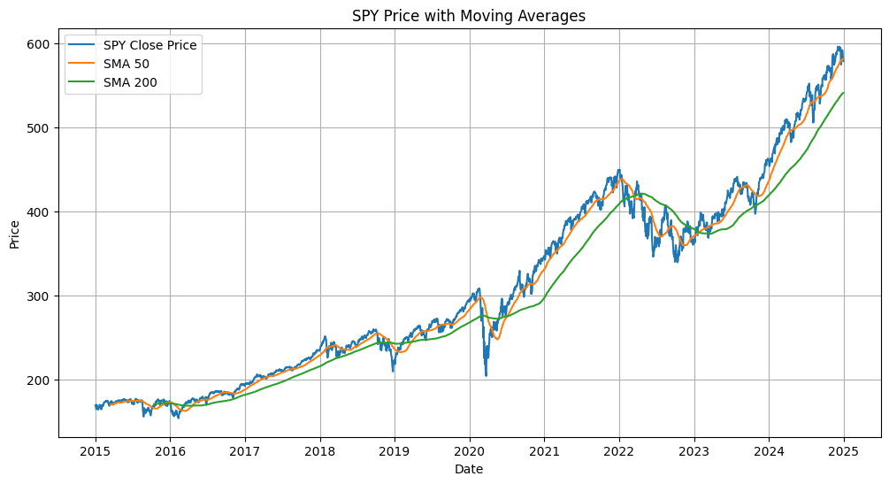
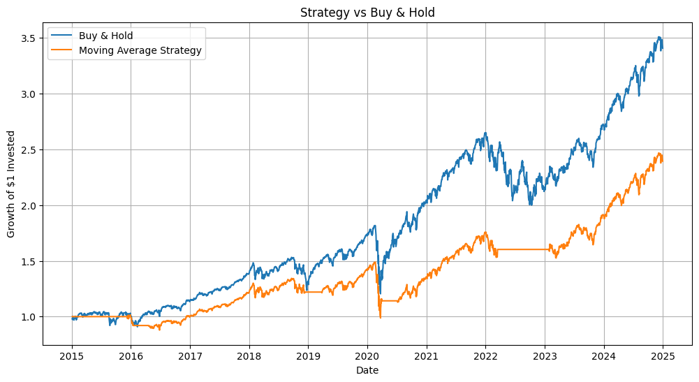
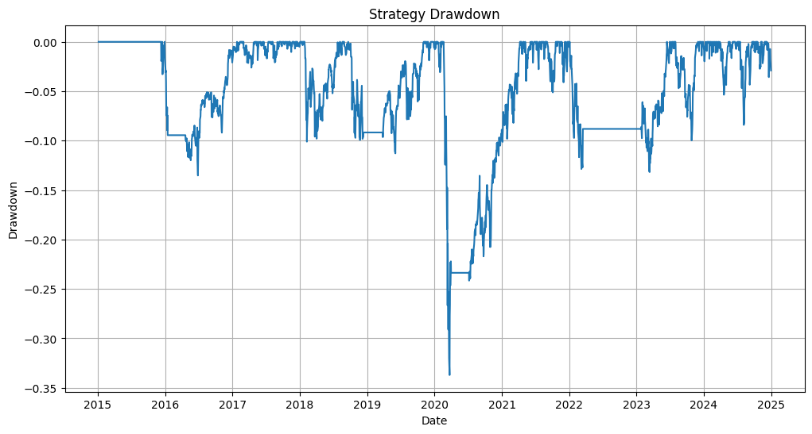

# Moving Average Trading Strategy Backtest

## Project Overview

This project implements and backtests a simple moving average crossover trading strategy using Python.

The objective is to generate trading signals based on short-term and long-term moving averages, compare the strategy against a buy-and-hold benchmark, and evaluate the performance using financial risk and return metrics.

## Tools Used

- Python
- pandas
- NumPy
- matplotlib
- yfinance

## Strategy Logic

The strategy uses two simple moving averages:

- 50-day Simple Moving Average
- 200-day Simple Moving Average

Trading rule:

- If SMA 50 is above SMA 200, the strategy is invested in the asset
- If SMA 50 is below SMA 200, the strategy is out of the market

## Main Features

- Download historical market data
- Calculate daily returns
- Compute moving averages
- Generate trading signals
- Backtest the strategy
- Compare strategy performance with buy-and-hold
- Calculate Sharpe Ratio
- Calculate Maximum Drawdown
- Visualize performance and drawdown

## Financial Concepts Covered

- Moving averages
- Trading signals
- Backtesting
- Buy-and-hold benchmark
- Equity curve
- Drawdown
- Sharpe Ratio

## Project Structure

```text
moving-average-backtest/
│
├── data/
├── images/
├── notebook/
├── src/
├── .gitignore
├── README.md
└── requirements.txt

## Results

The project backtests a moving average crossover strategy on SPY using:

- 50-day Simple Moving Average
- 200-day Simple Moving Average

The strategy is compared against a passive buy-and-hold benchmark.

The main metrics computed are:

- Strategy Annual Return
- Strategy Annual Volatility
- Strategy Sharpe Ratio
- Strategy Maximum Drawdown
- Buy & Hold Annual Return
- Buy & Hold Annual Volatility
- Buy & Hold Sharpe Ratio

The final results are saved in:

```text
data/strategy_summary.csv
```

## Visualizations

The project generates three main charts:

```text
images/moving_average_signals.png
images/strategy_vs_buy_hold.png
images/strategy_drawdown.png
```

### SPY Price with Moving Averages



### Strategy vs Buy & Hold



### Strategy Drawdown


